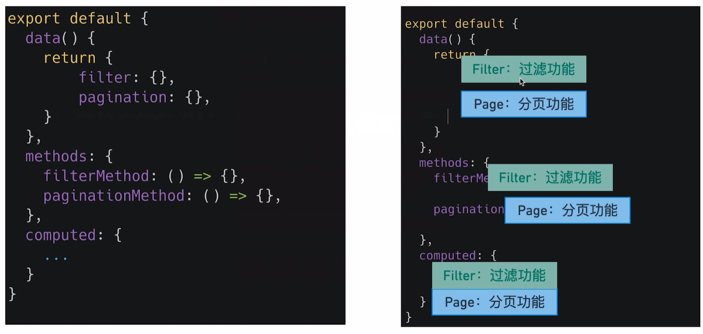
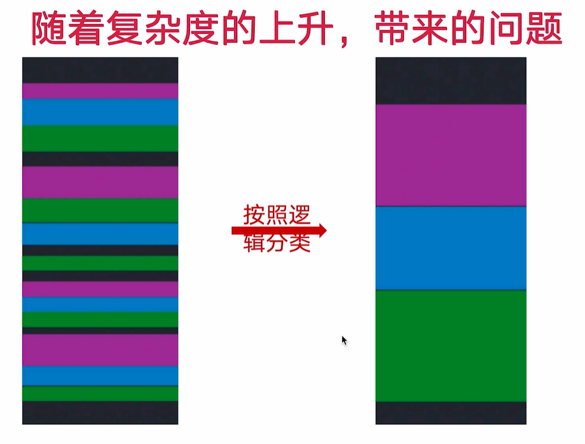
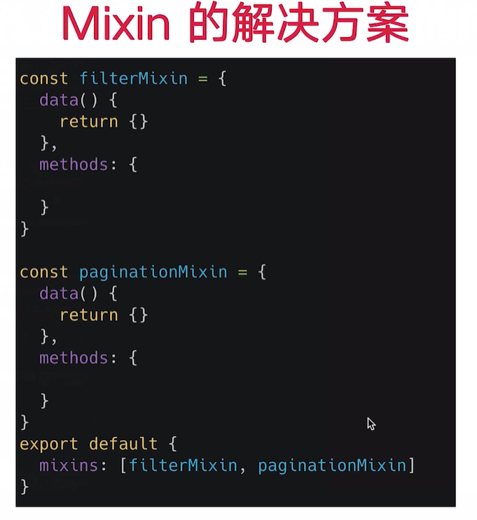
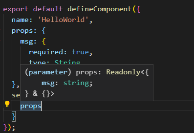
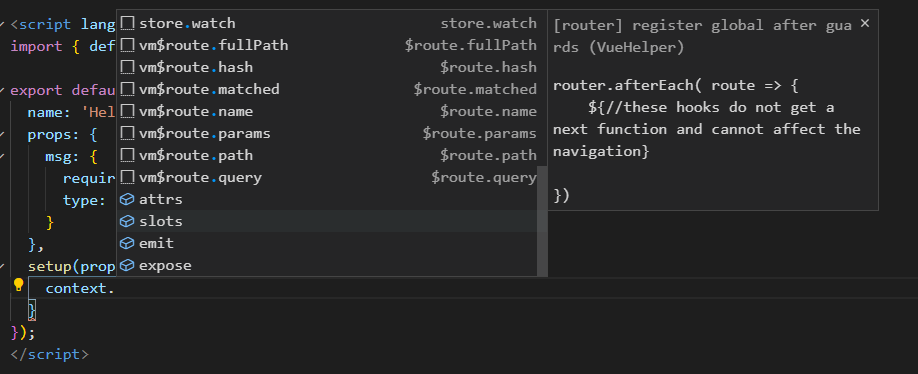
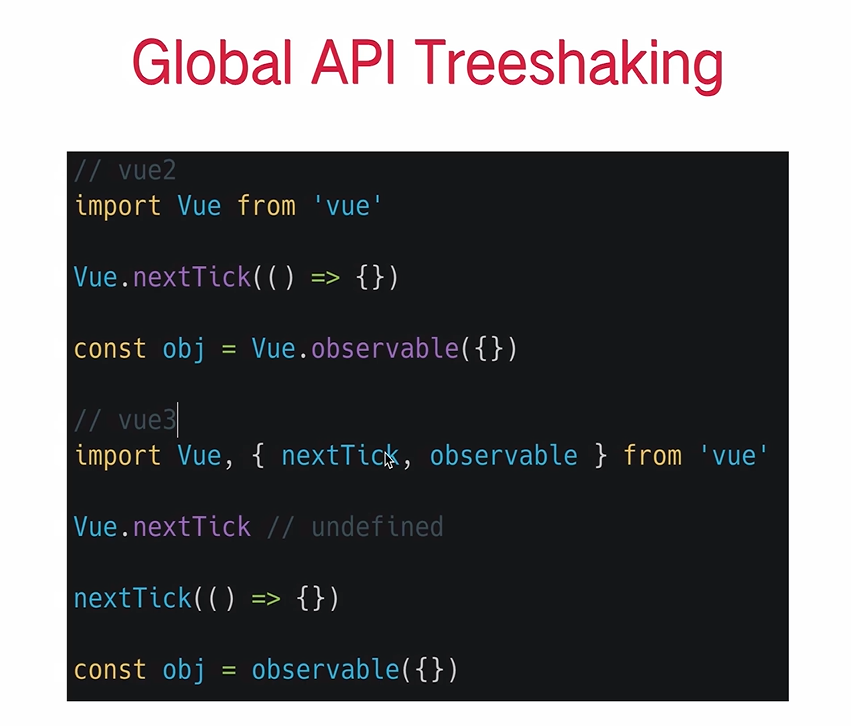

引用：https://jspang.com/detailed?id=64#toc226


## 为什么会有vue3

vue2的痛点：

### vue2复杂组件难以维护







vue2 mixin的缺点

1. 命名冲突
2. 不清楚暴露出来变量的作用
3. 重用到其他component经常遇到问题


### vue2很难集成typeScript


### vue2使用defineProperty,vue3使用proxy，响应式更高明

defineProperty只可以监听已经添加（数据初始化）的属性，导致vue2，有一些对象新添加属性和数组新添加数据不是响应式，要使用set方法

proxy可以监听所有属性，之后添加的也可以添加

```
Object.defineProperty(data,'count',{
      get(){},
      set(){},
    })
new Proxy(data,{
      get(key){},
      set(key,value){},
    })
```


## 创建vue3的vue-cli

[Vue cli](https://cli.vuejs.org/zh/)

```javascript
// 安装或者升级
npm install -g @vue/cli
# OR
yarn global add @vue/cli

// 保证 vue cli 版本在 4.5.0 以上
vue --version

// 创建项目
vue create my-project
```

然后的步骤

- Please pick a preset - 选择 **Manually select features**
- Check the features needed for your project - 多选择上 **TypeScript**，特别注意点空格是选择，点回车是下一步
- Choose a version of Vue.js that you want to start the project with - 选择 **3.x (Preview)**
- Use class-style component syntax - 输入 **n**，回车
- Use Babel alongside TypeScript - 输入**n**，回车
- Pick a linter / formatter config - 直接回车
- Pick additional lint features - 直接回车
- Where do you prefer placing config for Babel, ESLint, etc.? - 直接回车
- Save this as a preset for future projects? - 输入**n**，回车

启动图形化界面创建

```text
vue ui
```


## setup() 和ref()函数

```
<template>
  
  <div>
    <h2>欢迎光临红浪漫洗浴中心</h2>
    <div>请选择一位美女为你服务</div>
  </div>
  <div>
    <button
      v-for="(item, index) in girls"
      v-bind:key="index"
      @click="selectGirlFun(index)"
    >
      {{ index }} : {{ item }}
    </button>
  </div>
  <div>你选择了【{{ selectGirl }}】为你服务</div>
</template>

<script lang="ts">
import { defineComponent, ref } from "vue";
export default defineComponent({
  name: "App",
  setup() {
    const girls = ref(["大脚", "刘英", "晓红"]);
    const selectGirl = ref("");
    const selectGirlFun = (index: number) => {
      selectGirl.value = girls.value[index];
    };
    //因为在模板中这些变量和方法都需要条用，所以需要return出去。
    return {
      girls,
      selectGirl,
      selectGirlFun,
    };
  },
});
</script>
```

setup的props，contest参数






## computed和ref

```
<template>
  <h1>{{count}}</h1>
  <h1>{{double}}</h1>
  <button @click="increase">+1</button>
</template>

import { ref } from "vue"

setup() {
  // ref 是一个函数，它接受一个参数，返回的就是一个神奇的 响应式对象 。我们初始化的这个 0 作为参数包裹到这个对象中去，在未来可以检测到改变并作出对应的相应。
  const count = ref(0)
  const double = computed(() => {
    return count.value * 2
  })
  const increase = () => {
    count.value++
  }
  return {
    count,
    increase,
    double
  }
}
```

## computed和reactive

```
<template>
  <h1>{{count}}</h1>
  <h1>{{double}}</h1>
</template>

import { ref } from "vue"

setup() {
  const data  = reactive({
      count: 0,
      double: computed(() => {
    return count.value * 2
  }),
    })
    const refData = toRefs(data)
  return {
    ...refData
  }
}
```


## reactive()和toRefs()函数

```ts
<template>
  
  <div>
    <h2>欢迎光临红浪漫洗浴中心</h2>
    <div>请选择一位美女为你服务</div>
  </div>
  <div>
    <button
        v-for="(item, index) in girls"
        v-bind:key="index"
        @click="selectGirlFun(index)"
    >
      {{ index }} : {{ item }}
    </button>
  </div>
  <div>你选择了【{{ selectGirl }}】为你服务</div>
</template>


<script lang="ts">
  import {defineComponent,reactive,toRefs} from "vue";

  export default defineComponent({
    name: "App",
    setup() {
      interface DataProps {
        girls: string[];
        selectGirl: string;
        selectGirlFun: (index: number) => void;
      }
      const data: DataProps= reactive({
        girls: ['大脚', '刘英', '小红'],
        selectGirl: '',
        selectGirlFun: (index: number) => {
          data.selectGirl = data.girls[index]
        }
      })

      const toRefsData = toRefs(data)
      return {
          ...toRefsData
      }
    },
  });
</script>
```


##  Vue3 版本的生命周期 

Vue3 的生命周期比较多，我们需要一个个给大家讲。

- setup() :开始创建组件之前，在`beforeCreate`和`created`之前执行。创建的是`data`和`method`
- onBeforeMount() : 组件挂载到节点上之前执行的函数。
- onMounted() : 组件挂载完成后执行的函数。
- onBeforeUpdate(): 组件更新之前执行的函数。
- onUpdated(): 组件更新完成之后执行的函数。
- onBeforeUnmount(): 组件卸载之前执行的函数。
- onUnmounted(): 组件卸载完成后执行的函数
- onActivated(): 被包含在``中的组件，会多出两个生命周期钩子函数。被激活时执行。
- onDeactivated(): 比如从 A 组件，切换到 B 组件，A 组件消失时执行。
- onErrorCaptured(): 当捕获一个来自子孙组件的异常时激活钩子函数（以后用到再讲，不好展现）。

注：使用``组件会将数据保留在内存中，比如我们不想每次看到一个页面都重新加载数据，就可以使用``组件解决。

```
setup() {
  onMounted(() => {
    console.log('mounted')
  })
  onUpdated(() => {
    console.log('updated')
  })
  onRenderTriggered((event) => {
    console.log(event)
  })
}
```


## vue2生命周期和vue3生命周期对比

```
Vue2--------------vue3
beforeCreate  -> setup()
created       -> setup()
beforeMount   -> onBeforeMount
mounted       -> onMounted
beforeUpdate  -> onBeforeUpdate
updated       -> onUpdated
beforeDestroy -> onBeforeUnmount
destroyed     -> onUnmounted
activated     -> onActivated
deactivated   -> onDeactivated
errorCaptured -> onErrorCaptured
```

 除了这些钩子函数外，`Vue3.x`还增加了`onRenderTracked`和`onRenderTriggered`函数，这两个函数放到下节课再讲解。这节就先到这里了。 


## `onRenderTracked`和`onRenderTriggered`钩子函数的使用

Vue 官方的文档里，明确指出了。如果你使用 Vue3，请尽量使用新的生命周期钩子函数，也就是上节课写在`setup()`函数中带`on`的这些钩子函数。

[onRenderTracked 状态跟踪](https://jspang.com/detailed?id=64#toc328)

使用`onRenderTracked`同样要使用`import`进行引入。

```js
import { .... ,onRenderTracked,} from "vue";
```

引用后就可以在`setup()`函数中进行引用了。

```js
onRenderTracked((event) => {
  console.log("状态跟踪组件----------->");
  console.log(event);
});
```

写完后可以到终端中启动测试服务`yarn serve`,然后看一下效果，在组件没有更新的时候`onRenderTracked`是不会执行的，组件更新时，他会跟组里边每个值和方法的变化。

[onRenderTriggered 状态触发](https://jspang.com/detailed?id=64#toc329)

如果把`onRenderTracked`比喻成散弹枪，每个值都进行跟踪，那`onRenderTriggered`就是狙击枪，只精确跟踪发生变化的值，进行针对性调试。

使用它同样要先用`import`进行引入

```js
import { .... ,onRenderTriggered,} from "vue";
```

在使用`onRenderTriggered`前，记得注释相应的`onRenderTracked`代码，这样看起来会直观很多。 然后把`onRenderTriggered()`函数，写在`setup()`函数里边，

```js
onRenderTriggered((event) => {
  console.log("状态触发组件--------------->");
  console.log(event);
});
```

对 event 对象属性的详细介绍：

```js
- key 那边变量发生了变化
- newValue 更新后变量的值
- oldValue 更新前变量的值
- target 目前页面中的响应变量和函数
```

通过这些你能很好的对代码进行调试。这些调试用的钩子函数，如果你能正确合理的使用，是真的可以快速解决问题的。

有的小伙伴看到这里肯定会觉的，这个和`watch`很像，那下节课我们再讲一下`watch`的使用吧，这个也有了很大的变化。


## watch的使用和注意事项

vue3使用setup


watch一个数据

```
如果只有一个数据，用ref导入
import { watch} from "vue"
const overText = ref("红浪漫");
  const overAction = () => {
    overText.value = overText.value + "点餐完成 | ";
  };
  return { ...refData,  overText,   overAction};
 watch(overText, (newValue, oldValue) => {
    document.title = newValue;
  });
```

watch多个值时，用reactive

```
const data = reactive({
      selectGirl: "",
    });


watch([overText, () => data.selectGirl], (newValue, oldValue) => {
      console.log(`new--->${newValue}`);
      console.log(`old--->${oldValue}`);
      document.title = newValue[0];  //返回的newValue也是一个数组
  });
```


## emits事件发送

使用$emit


**瞬移组件示例**

Modal 组件

```vue
<template>
<teleport to="#modal">
  <div id="center" v-if="isOpen">
    <h2><slot>this is a modal</slot></h2>
    <button @click="buttonClick">Close</button>
  </div>
</teleport>
</template>
<script lang="ts">
import { defineComponent } from 'vue'
export default defineComponent({
  props: {
    isOpen: Boolean,
  },
  emits: {
    'close-modal': null
  },
  setup(props, context) {
    const buttonClick = () => {
      context.emit('close-modal')
    }
    return {
      buttonClick
    }
  }
})
</script>
<style>
  #center {
    width: 200px;
    height: 200px;
    border: 2px solid black;
    background: white;
    position: fixed;
    left: 50%;
    top: 50%;
    margin-left: -100px;
    margin-top: -100px;
  }
</style>
```

在 App 组件中使用

```javascript
const modalIsOpen = ref(false)
const openModal = () => {
  modalIsOpen.value = true
}
const onModalClose = () => {
  modalIsOpen.value = false
}

<button @click="openModal">Open Modal</button><br/>
<modal :isOpen="modalIsOpen" @close-modal="onModalClose"> My Modal !!!!</modal>
```


## vue3模块化

### 自定义hooks，使用use开头

在src下创建`hooks/useNowTime.ts`文件

```
import { ref } from "vue";

const nowTime = ref("00:00:00");
const getNowTime = () => {
  const now = new Date();
  const hour = now.getHours() < 10 ? "0" + now.getHours() : now.getHours();
  const min = now.getMinutes() < 10 ? "0" + now.getMinutes() : now.getMinutes();
  const sec = now.getSeconds() < 10 ? "0" + now.getSeconds() : now.getSeconds();
  nowTime.value = hour + ":" + min + ":" + sec;
  setTimeout(getNowTime, 1000);
};

export { nowTime, getNowTime };
```

在app.vue里引用

```

<div><button @click="getNowTime">显示时间</button></div>
<div>{{ nowTime }}</div>


import { nowTime, getNowTime } from "./hooks/useNowTime";
setup() {
    return {
      nowTime,
      getNowTime
    };
  },
```


### 模块化开发鼠标追踪器

```javascript
// 在单组件内添加对应逻辑
const x = ref(0)
const y = ref(0)
const updateMouse = (e: MouseEvent) => {
  x.value = e.pageX
  y.value = e.pageY
}
onMounted(() => {
  document.addEventListener('click', updateMouse)
})
onUnmounted(() => {
  document.removeEventListener('click', updateMouse)
})

// 将组件内逻辑抽象成可复用的函数
function useMouseTracker() {
  // const positions = reactive<MousePostion>({
  //   x: 0,
  //   y: 0
  // })
  const x = ref(0)
  const y = ref(0)
  const updatePosition = (event: MouseEvent) => {
    x.value = event.clientX
    y.value = event.clientY 
  }
  onMounted(() => {
    document.addEventListener('click', updatePosition)
  })
  onUnmounted(() => {
    document.removeEventListener('click', updatePosition)
  })
  return { x, y }
}

export default useMouseTracker
```

**vue3 这种实现方式的优点**

- 第一：它可以清楚的知道 xy 这两个值的来源，这两个参数是干什么的，他们来自 useMouseTracker 的返回，那么它们就是用来追踪鼠标位置的值。
- 第二：我们可以xy 可以设置任何别名，这样就避免了命名冲突的风险。
- 第三：这段逻辑可以脱离组件存在，因为它本来就和组件的实现没有任何关系，我们不需要添加任何组件实现相应的功能。只有逻辑代码在里面，不需要模版。


### 模块化结合typescript - 泛型改造

```ts
// 为函数添加泛型
function useURLLoader<T>(url: string) {
  const result = ref<T | null>(null)
// 在应用中的使用，可以定义不同的数据类型
interface DogResult {
  message: string;
  status: string;
}
interface CatResult {
  id: string;
  url: string;
  width: number;
  height: number;
}

// 免费猫图片的 API  https://api.thecatapi.com/v1/images/search?limit=1
const { result, loading, loaded } = useURLLoader<CatResult[]>('https://api.thecatapi.com/v1/images/search?limit=1')

```


## vue3对typeScript的加持

defineComponent:为了使传入的对象获取对应的类型，完全为了服务typeScript存在

在vsCode编辑器中使用defineComponent就会有vue3语法糖提示

```
<script lang="ts">
import { defineComponent } from 'vue';

export default defineComponent({
  name: 'HelloWorld',
  props: {
    msg: String,
  },
});
</script>
```


##  Teleport瞬间移动组件 

`Teleport`方法，可以把`Dialog`组件渲染到你任意想渲染的外部Dom上，不必嵌套再`#app`里了，这样就不会互相干扰了。你可以把`Teleport`看成一个传送门，把你的组件传送到你需要的地方。 `teleport`组件和其它组件没有任何其它的差异，用起来都是一样的。

使用的第一步是把你编写的组件用``标签进行包裹，在组件上有一个`to`属性，这个就是要写你需要渲染的`DOM`ID了。

```js
<template>
  <teleport to="#modal">
    <div id="center">
      <h2>JSPang11</h2>
    </div>
  </teleport>
</template>
```


组件写好后，在App.vue中使用就非常简单了，先引入这个，然后声明为`component`就可以了。

```js
//...
import modal from "./components/Modal.vue";
const app = {
  name: "App",
  components: {
    modal,
  },
  //...
}
```


然后我们在打开`/public/index.html`,增加一个`model`节点。

```js
<div id="app"></div>
<div id="modal"></div>
```

在需要使用的地方引入，这时候在浏览器中预览，就会发现，现在组件已经挂载到`model`节点上了，这就是`teleport`组件的使用了。


## Suspense异步请求组件

### Suspense - 异步请求好帮手第一部分

定义一个异步组件，在 setup 返回一个 Promise，AsyncShow.vue

```vue
<template>
  <h1>{{result}}</h1>
</template>
<script lang="ts">
import { defineComponent } from 'vue'
export default defineComponent({
  setup() {
    return new Promise((resolve) => {
      setTimeout(() => {
        return resolve({
          result: 42
        })
      }, 3000)
    })
  }
})
</script>
```

在 App 中使用

```html
<Suspense>
  <template #default>
    <async-show />
  </template>
  <template #fallback>
    <h1>Loading !...</h1>
  </template>
</Suspense>
```

### Suspense - 异步请求好帮手第二部分

使用 async await 改造一下异步请求, 新建一个 DogShow.vue 组件

```vue
<template>
  
</template>

<script lang="ts">
import axios from 'axios'
import { defineComponent } from 'vue'
export default defineComponent({
  async setup() {//promise语法糖 返回的也是promise对象
    const rawData = await axios.get('https://dog.ceo/api/breeds/image')
    return {
      result: rawData.data
    }
  }
})
</script>
```

Suspense 中可以添加多个异步组件

```html
<Suspense>
  <template #default>
    <async-show />
    <dog-show />
  </template>
  <template #fallback>
    <h1>Loading !...</h1>
  </template>
</Suspense>
```

## onErrorCaptured处理异步请求错误

在`vue3.x`的版本中，可以使用`onErrorCaptured`这个钩子函数来捕获异常。在使用这个钩子函数前，需要先进行引入.

```js
import { ref , onErrorCaptured} from "vue";
```

有了`onErrorCaptured`就可以直接在`setup()`函数中直接使用了。钩子函数要求我们返回一个布尔值，代表错误是否向上传递，我们这里返回了`true`。

```js
const app = {
  name: "App",
  components: { AsyncShow, GirlShow },
  setup() {
    onErrorCaptured((error: any) => {
      console.log(`error====>`,error)
      return true  
    })
    return {};
  },
};
```

写好后，我们故意把请求地址写错，然后打开浏览器的终端，看一下控制台已经捕获到错误了。在实际工作中，你可以根据你的真实需求，处理这些错误。


## 全局api修改

 [Global API Change](https://v3.vuejs.org/guide/migration/global-api.html#global-api) 

Vue2 的全局配置

```javascript
import Vue from 'vue'
import App from './App.vue'

Vue.config.ignoredElements = [/^app-/]
Vue.use(/* ... */)
Vue.mixin(/* ... */)
Vue.component(/* ... */)
Vue.directive(/* ... */)

Vue.prototype.customProperty = () => {}

new Vue({
  render: h => h(App)
}).$mount('#app')
```

Vue2 这样写在一定程度上修改了 Vue 对象的全局状态。

- 第一，在单元测试中，全局配置非常容易污染全局环境，用户需要在每次 case 之间，保存和恢复配置。有一些 api （vue use vue mixin）甚至没有方法恢复配置，这就让一些插件的测试非常的困难。
- 第二，在不同的 APP 中，如果想共享一份有不同配置的 vue 对象，也变得非常困难。

**Vue3 的修改**

```typescript
import { createApp } from 'vue'
import App from './App.vue'

const app = createApp(App)
// 这个时候 app 就是一个 App 的实例，现在再设置任何的配置是在不同的 app 实例上面的，不会像vue2 一样发生任何的冲突。

app.config.isCustomElement = tag => tag.startsWith('app-')
app.use(/* ... */)
app.mixin(/* ... */)
app.component(/* ... */)
app.directive(/* ... */)

app.config.globalProperties.customProperty = () => {}

// 当配置结束以后，我们再把 App 使用 mount 方法挂载到固定的 DOM 的节点上。
app.mount(App, '#app')
```




具名导出，完美支持webpack treeShaking打包


## composition Api 组合式api


# 问题

## 怎么在setup中拿到emits的值

