> 第02阶段.前端基本功.前端基础.入门语法


# VSCode开发工具-使用帮助文档

## 学习目标

- 应用
  - 使用 VSCode 编辑单个文件
  - 使用 VSCode 编辑文件夹内文件，并新建 文件和文件夹
  - 能熟练使用扩展中心进行插件安装
  - 使用基本Emmet语法创建 HTML 标签
  - 使用常用快捷键


## 1. VSCode介绍

- Visual Studio Code（以下简称vscode）是一个微软提供的轻量且强大的 *代码编辑器* 
- 插件安装方便


### 1) VSCode 安装提示

vscode-安装步骤1-接受协议

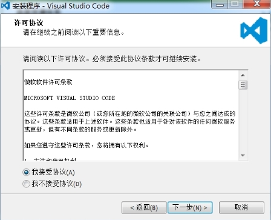

vscode-安装步骤2-选择安装路径

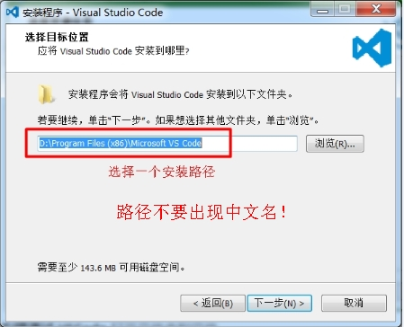

vscode-安装步骤3-打钩-方便通过鼠标右键用 VSCode 打开文件夹和文件

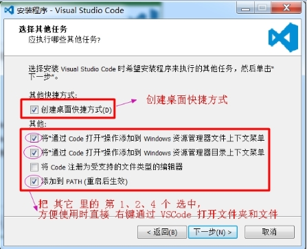

vscode-安装步骤4-点击安装

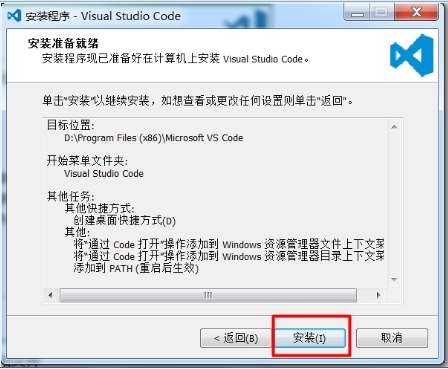


**右键通过 VSCode** 打开文件夹和文件

 					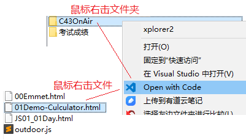

### 2) 界面主要区域介绍

  左侧导航区 有5个选项，**我们前期主要使用 第1个，偶尔使用第5个**。（2、3、4 暂时用不到）

 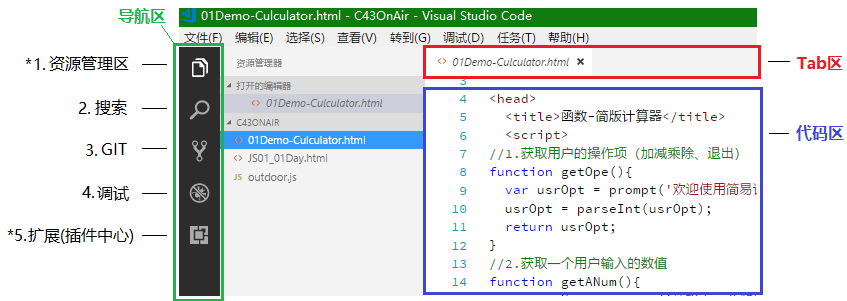


### 3) 资源管理区使用

#### **① 单个文件编辑**

当我们用 VSCode 打开单个文件时，在资源管理区 会在 `打开的编辑器` 区 显示文件

 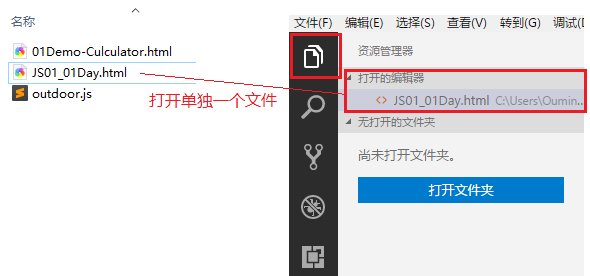


#### **② 文件夹文件编辑**

打开文件夹 + 新建文件    和     文件夹 + 关闭文件夹

##### **a.打开文件夹方式**

​	1.1通过   `打开文件夹` 按钮 来选择文件夹

​	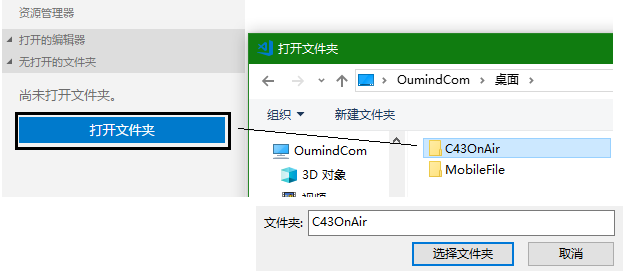

​	1.2通过 在 `文件夹` 上 右键鼠标    `Open With Code`

​	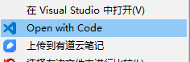


##### b. 新建文件/文件夹

可以通过 快捷按钮 直接在 打开的文件夹中 **新建** 文件 和 子文件夹

​	 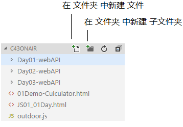

##### c.关闭文件夹

   菜单栏 文件 --> 关闭文件夹

​	 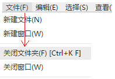

### 4) 扩展 (插件中心) 使用

精选！15个必备的VSCode插件：

https://blog.csdn.net/qq_38906523/article/details/77278403


- VSCode 提供了众多插件，让我们可以更高效便捷的工作。这些插件 有各种官方提供的，也有用户自己编写的

  ​	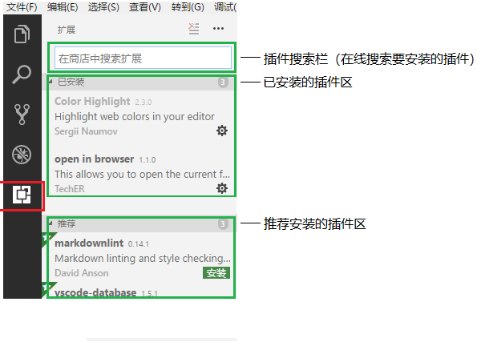

  

#### **常用插件**列表

- **现在需要使用的插件：** **Color Highlight，Emmet，open in browser**, Chinese (Simplified) Language Pack for Visual Studio Code(编辑器界面，默认语言设置成中文的插件)
- **其他几个推荐安装的插件**: AutoFileName  ,  vscode-icon ,  CSS Peek , Prettier - Code formatter , Minify，

#### Chinese (Simplified) Language Pack for Visual Studio Code

搜chinese，选择下图这个中文简体


#### **open in browser** ，意思是：在浏览器打开

 一款用来直接调用默认浏览器打开 文件 的插件

​     


#### Color Highlight : 提示颜色块

一款用来在 样式表 代码 中直接显示 颜色块 的插件

​		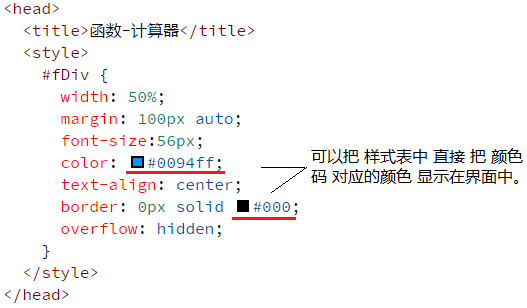

#### **Emmet（vscode自带了，这个不用安装）**

​	 一款 **VSCode内置** 的快速 生成代码 的插件，举例：

**1）.**快速生成 HTML 页面结构：使用 `!` 或者 `html5`  + tab键

 	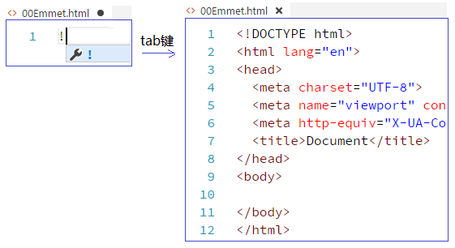

**2）.**快速生成 div：使用 `标签名` + tab键

 		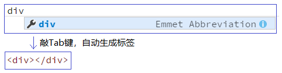

**3）.**快速生成 3 个 li 标签

​          	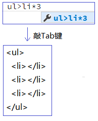

（**更多详细语法，参见 本文档 中的   3.扩展内容- 1)Emmet语法**）


其他几个推荐的插件：

#### AutoFileName：自动提示文件路径

#### vscode-icon : 显示文件类型的小图标

让 vscode 资源树目录加上图标，必备良品！

​		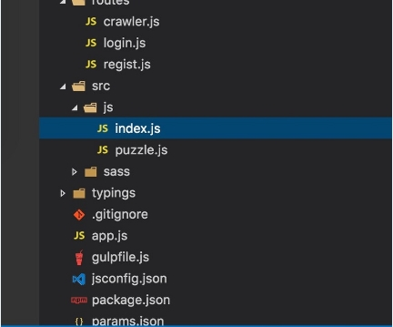

设置方法：

​	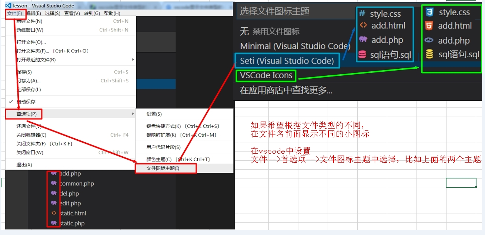


#### CSS Peek

使用此插件，你可以追踪至样式表中 CSS 类和 ids 定义的地方。

当你**在 HTML 文件中右键单击选择器**时，选择“ Go to Definition 和 Peek definition ”选项，它便会给你发送样式设置的 CSS 代码。

​	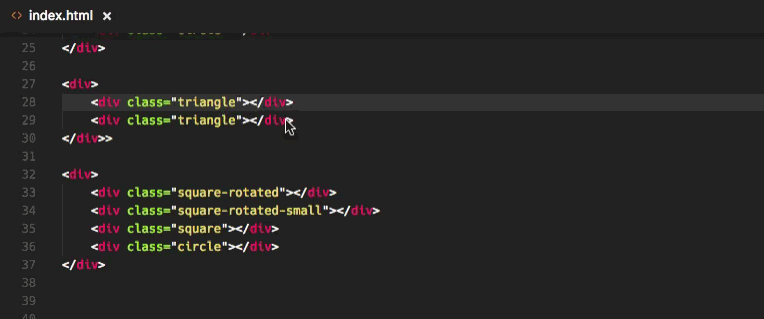

#### **Prettify  json-html-css**	   **另一个 代码格式化**

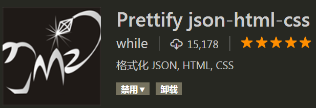

#### Prettier - Code formatter 代码格式化

Prettier 是目前 Web 开发中最受欢迎的代码格式化程序。安装了这个插件，它就能够自动应用 Prettier，并将整个 JS 和 CSS 文档快速格式化为统一的代码样式。

​	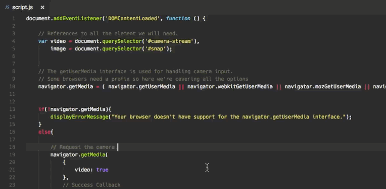


#### Minify 压缩代码

这是一款用于压缩合并 JavaScript 和 CSS 文件的应用程序。它提供了大量自定义的设置，以及自动压缩保存并导出为.min文件的选项。它能够分别通过 uglify-js、clean-css 和 html-minifier，与 JavaScript、CSS 和 HTML 协同工作。

使用方法：

1、打开需要压缩的JS文件。

2、**按F1键**,     输入:   minify

3、按 ctrl+s 保存，会生成一个新的带min的  压缩过的文件

​	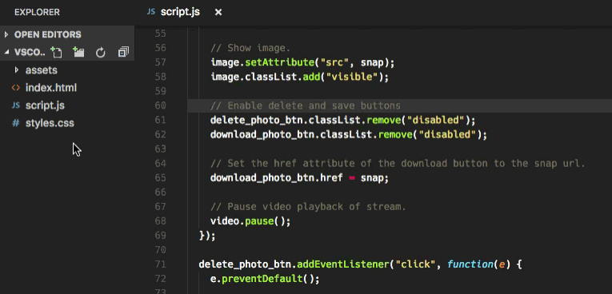

## 2. 常见操作

### 1) 放大缩小字体

- 快捷键
  放大  `Ctrl` +    `+` 
  缩小  `Ctrl` +    `-`

  ​	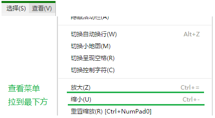


### 2) 注释

- 快捷键
  行注释 `Ctrl` + `/`
  块注释 `Alt` + `Shift` + `A`

  ​	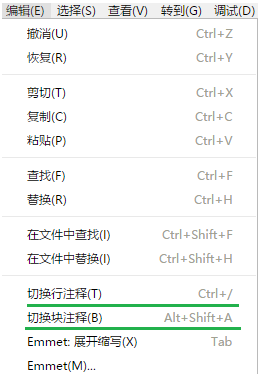


## 3. 扩展内容-Emmet语法介绍

### 1) Emmet 语法规则

- 介绍

  ```js
  Emmet (前身为 Zen Coding) 是一个能大幅度提高前端开发效率的一个工具。在前端开发的过程中，一大部分的工作是写 HTML、CSS 代码。特别是手动编写 HTML 代码的时候，效率会特别低下，因为需要敲打很多尖括号，而且很多标签都需要闭合标签等。于是，就有了 Emmet，它可以极大的提高代码编写的效率，它提供了一种非常简练的语法规则，然后立刻生成对应的 HTML 结构或者 CSS 代码，同时还有多种实用的功能帮助进行前端开发。
  ```

  VsCode内置了Emmet语法,在后缀为.html/.css中输入缩写后按 `Tab键` 即会自动生成相应代码

- 语法规则

  ```
  E 代表HTML标签。
  E#id 代表id属性。
  E.class 代表class属性。
  E[attr=foo] 代表某一个特定属性。
  E{foo} 代表标签包含的内容是foo。
  E>N 代表N是E的子元素。
  E+N 代表N是E的同级元素。
  E^N 代表N是E的上级元素。
  ```

### 2) Emmet 详细语法(常用)

#### ① 元素(Elements)

可以使用元素的名称，如div或p来生成HTML标签。

```html
div => <div> </div>
foo => <foo> </foo>
html:5 => 将生成html5标准的包含body为空基本dom
html:xt => 生成XHTML过渡文档类型,DOCTYPE为XHTML
html:4s => 生成HTML4严格文档类型,DOCTYPE为HTML 4.01
a:mail          => <a href="mailto:"></a>
a:link          => <a href="http://"></a>
base            => <base href="">
br              => <br>
link            => <link rel="stylesheet" href="">
script:src      => <script src=""></script>
form:get        => <form action="" method="get"></form>
label           => <label for=""></label>
input           => <input type="text">
inp             => <input type="text" name="" id="">
input:hidden    => <input type="hidden" name="">       input:h也可以
input:email     => <input type="email" name="" id="">
input:password  => <input type="password" name="" id="">
input:checkbox  => <input type="checkbox" name="" id="">
input:radio     => <input type="radio" name="" id="">
select          => <select name="" id=""></select>
option          => <option value=""></option>
bq              => <blockquote></blockquote>
btn             => <button></button>
btn:s           => <button type="submit"></button>
btn:r           => <button type="reset"></button>
```

#### ② 文本操作符(Text)

```html
div{这是一段文本}  =>  <div>这是一段文本</div>
a{点我点我}  =>  <a href="">点我点我</a>
```

#### ③ 属性操作符(Attribute)

属性运算符用于修改输出元素的属性，如：id 和 class ( `elem#id` and `elem.class` )

```html
div.test  =>  <div class="test"></div>
div#pageId  =>  <div id="pageId"></div>
```

#### ④ 嵌套操作符(Nesting)

嵌套操作符用于将缩写元素放置在生成的树中，是否应放置在上下文元素的内部或附近

- 子级：通过 `>` 字符标识元素生成嵌套子级元素，可以配合元素属性进行连写，如：

```html
div#pageId>ul>li 
=> 
<div id="pageId">
    <ul>
        <li></li>
    </ul>
</div>
```

- 同级：通过 `+` 字符表示生成兄弟级元素，如：

```html
div#pageId+div.child
=>
<div id="pageId"></div>
<div class="child"></div>
```

- 父级：`^` 用于生成父级元素的同级元素，从这个 `^` 字符所在位置开始，查找左侧最近的元素的父级元素并生成其兄弟级元素，如：

```html
div>p.parent>span.child{有趣的代码}^ul.brother>li
=>
<div>
    <p class="parent">
        <span class="child"></span>
    </p>
    <ul class="brother">
        <li></li>
    </ul>
</div>
```

#### ⑤ 乘法(Multiplication)

- 使用 N 即可自动生成重复项，N是一个正整数。

```html
ul>li*3
=>
<ul>
	<li></li>
	<li></li>
	<li></li>
</ul>
```

#### ⑥ 自动计数(numbering)

- 生成重复项时增加一个序号，只需要加上 `$ ` 符号即可。

```html
ul>li.item${$}*3
<ul>
	<li class="item1">1</li>
	<li class="item2">2</li>
	<li class="item3">3</li>
</ul>
```

> 注意：如果生成 两位数 则使用两个连续的 $$，更多位数以此类推~~

#### ⑦ Emmet生成CSS语法

- Emmet 不仅能生成 HTML，还可以生成 CSS

参考：[【emmet系列之CSS语法】](http://www.cnblogs.com/moyuling/p/4939922.html)

## 4. VSCode 常用快捷键

```html
上下移动一行：Alt + Up / Alt + Down
向下复制行：Shift + Alt + Down
在当前行下方插入一行:   Ctrl+Enter
在当前行上方插入一行:   Ctrl+Shift+Enter

转到行首/行尾：Home / End
转到文件头/文件尾：Ctrl + Home / Ctrl + End

html代码格式化：Shift＋Alt + F

查找:   Ctrl+F
查找替换:   Ctrl+H
整个文件夹中查找 Ctrl+Shift+F 匹配符

F1 或 Ctrl+Shift+P（俗称万能键）  ：打开命令面板。

代码行缩进 Ctrl+[ 、 Ctrl+]
代码折叠展开 Ctrl+Shift+[ 、 Ctrl+Shift+]
折叠所有区域代码的快捷： ctrl + k      ctrl + 0（数字0） ;
展开所有折叠区域代码的快捷：ctrl +k      ctrl + J ;
ctrl+K  ctrl+[  折叠本级
ctrl+K  ctrl+]  取消折叠本级

```

- 可以修改快捷键：菜单 文件 --> 首选项 --> 键盘快捷方式
  ​


## 5. 常见问题和使用技巧

### 1) vscode-查看键盘快捷方式

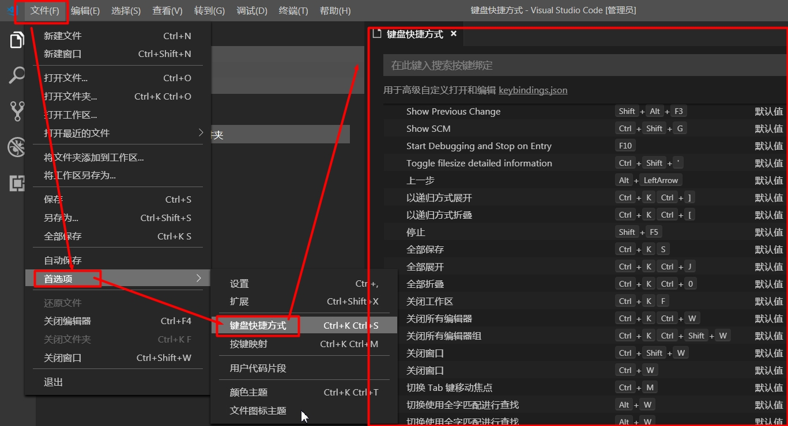

### 2) 如何设置或关闭自动保存

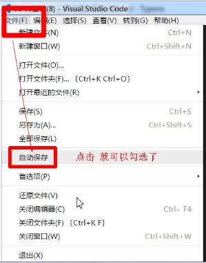


### **3) 如何关闭自动更新提示**

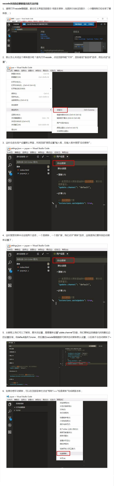

### 4) 在编辑器最上面显示文件的完整路径

提示：如果看不清下面这个图，可以去看【media】文件夹中的原图片：技巧-vscode-在最上面显示文件的完整路径.jpg

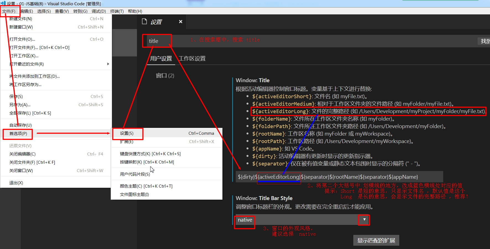


### **5) vscode设置成中文语言**

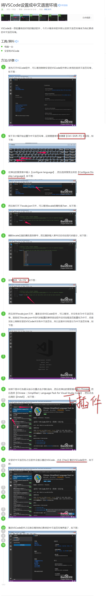


### 6) vscode设置让鼠标滚动改变字体大小

文件-->首选项-->设置---> 在搜索框输入 "editor.mouseWheelZoom" --->勾选

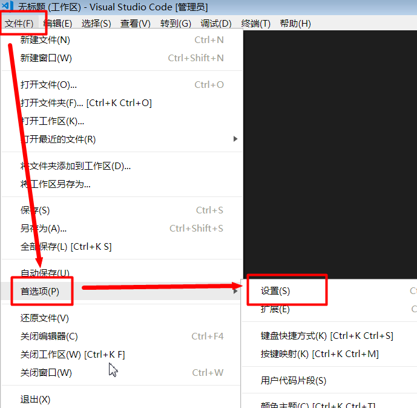

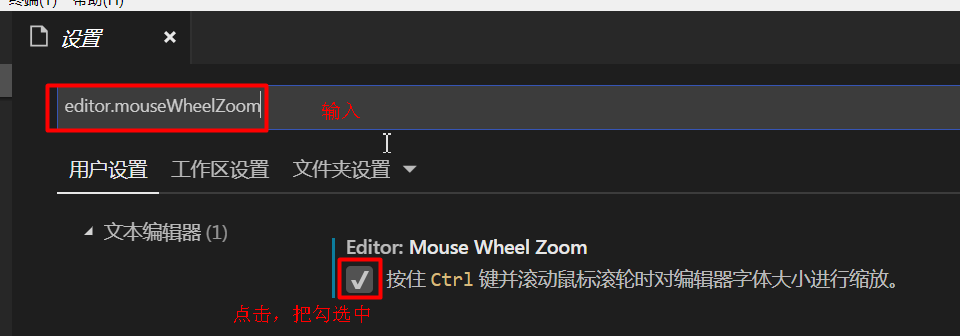

### 6) vs code中设置html5 快速生成模板

参考   <https://blog.csdn.net/SilenceJude/article/details/83273950>

按英文的！和h:5都可以快速生成html模板，
首先打开 snippets,


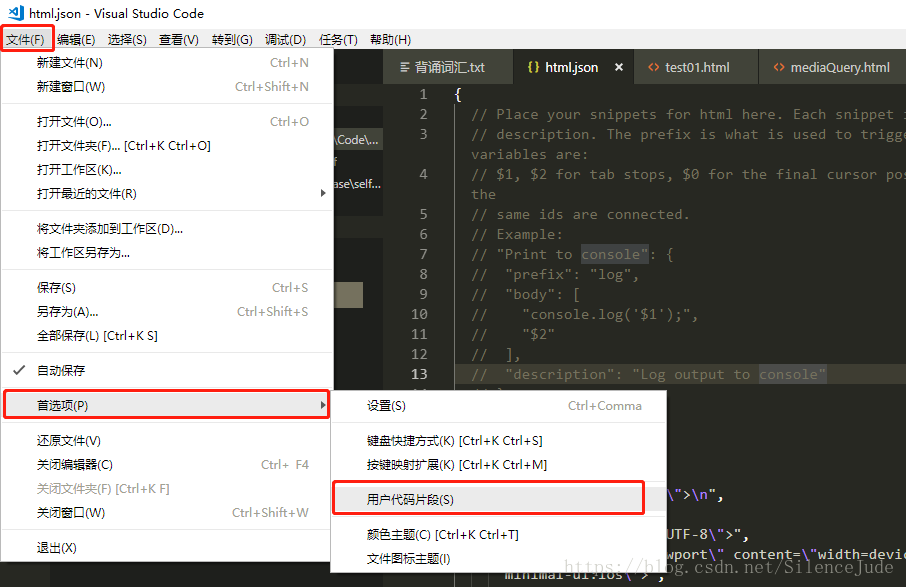
然后输入以下代码段：

```
	"h5 sample": {
		"prefix": "h",
		"body": [
		  "<!DOCTYPE html>",
		  "<html lang=\"zh-CN\">\n",
		  "<head>",
		  "\t<meta charset=\"UTF-8\">",
		  "\t<meta name=\"viewport\" content=\"width=device-width, initial-scale=1.0, minimum-scale=1.0, maximum-scale=1.0, user-scalable=no\">",
		  "\t<meta http-equiv=\"X-UA-Compatible\" content=\"ie=edge\">",
		  "\t<title>Document</title>",
		  "\t<link rel=\"stylesheet\" href=\"\">",
		  "\t<script src=\"\"></script>",
		  "</head>\n",
		  "<body>\n\t$1",
		  "</body>\n",
		  "</html>"
		],
		"description": "The full sample code - html5."
	  }
```

这里的 “prefix”: “h”,指的是你自定义的快捷代码，这里我输入h就会出现快速生成代码提示，也可以自定义其他字段。
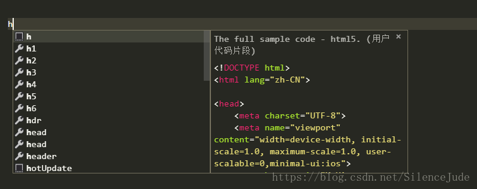

### 7) 修改VS Code(即emmet语法)自动生成的HTML5模板

- <font color='red'>`在对emmet配置/文件修改前，请务必备份，以防万一`</font>；
- 修改emmet配件文件需要关闭VSCode并重新打开方可生效。
- 以下操作均在win7+VSCode 1.31.1下验证通过；
- 操作系统版本或软件版本不一样，修改结果有可能不一样。

------

### 8) 将H5模板的lang属性值修改成zh-CN

1. 找到下面的文件

> {VSC安装路径}\resources\app\extensions\emmet\node_modules\vscode-emmet-helper\out\expand\expand-full.js

1. 使用notepad或VSC打开它，搜索**defaultVariables**，在第1个搜索结果中，即可看到关于lang: 'en'的描述，将其中的**en**替换成**zh-CN**并保存即可。

> 如果使用VSC打开，大概在5657行处即有defaultVariables = `{ lang: 'en', locale: 'en-US', charset: 'UTF-8' }`的描述。

------

### 9) 修改H5模板生成时光标的初始位置

> 默认情况下，使用！感叹号生成H5模板时，光标默认是选中device-width文本状态，需要4-5个Tab键才能将光标移入body中。

1. 找到下面的文件

> {VSC安装路径}\resources\app\extensions\emmet\node_modules\vscode-emmet-helper\out\expand\expand-full.js，使用VSCode打开

1. 搜索关键字**device-width**即可找到如下代码："meta[name=viewport content='width={2:1.0}']"，删除  ==`${1:`==    及  ==`}`==  即可解除初始光标对device-width的文本选中状态
2. 同理，删除`${2:`及`}`即可解除初始光标对1.0的文本选中状态
3. 使用VSC打开，代码所在行数大概在5004

------

### 10) VSCode下emmet生成H5模板的简单总结

1. expand-full.js文件是emmet在VSCode的全局配件文件。

> ```
> 再提醒一次，修改之前请务必备份之expand-full.js，以防不测。
> ```

1. 英文状态下的!(感叹号)可触发emmet的H5模板。
2. 使用VSC打开expand-full.js文件，定位于5100行。大概有3行代码(逗号分隔)，如下
   `"!!!": "{<!DOCTYPE html>}",` 
   `"doc": "html[lang=${lang}]>(head>meta[charset=${charset}]+meta:vp+meta:edge+title{${1:Document}})+body",` 
   `"!|html:5": "!!!+doc",`
3. 第1行的代码的意思大概就是使用3个!即可自动补全`<!DOCTYPE html>` 
   第3行代码的意思是键1个!即可调第1行的补全功能及第2行的补全功能。
4. 重点是第2行代码，`${lang}`的意思应该是寻找关于lang的变量，我估计直接将常量lang="zh-CN"写死在此处是可行的。`${charset}`同理可证。
5. `meta:vp`将会调用4986行处的代码块，这个块里使用1:及2:依次控制着2个光标选中状态，建议清除1:和2:
   和包裹它们的$及对应的`{}`。`meta:edge`同埋可证。
6. `title{${1:Document}}`，其中title即为H5模板的页面标题，$应该是类似于变量的引用，`1:`还是意味着初始时光标在标题行的第1次选中Document文本状态，后者也就是模板页面的标题，完全可以修改成自己想要字符，如 黑马程序员 。

------

### 后续

1. 完成修改后，H5模板初始时，光标是`<body></body>`之间，减少了不必要的干扰，lang的属性值是zh-CN，减少了某些浏览器集成语言检测的干扰，还可以将缺省的标题修改成自己的个性文字。

2. ```html
   <!DOCTYPE html>
   <html lang="zh-CN">
       <head>
           <meta charset="UTF-8">
           <meta name="viewport" content="width=device-width, initial-scale=1.0">
           <meta http-equiv="X-UA-Compatible" content="ie=edge">
           <title>黑马培训</title>
           <style>
           </style>
       </head>
   
       <body>
   
       </body>
   </html>
   
   ```

   

3. `charset="UTF-8"`的修改应该是在{VSCode安装路径}\resources\app\extensions\html\snippets\html.snippets.json文件中进行。

## 6. 深度阅读

[《VsCode中使用Emmet神器快速编写HTML代码》](https://www.cnblogs.com/summit7ca/p/6944215.html)

[《vscode: Visual Studio Code 常用快捷键》](http://www.cnblogs.com/bindong/p/6045957.html)


